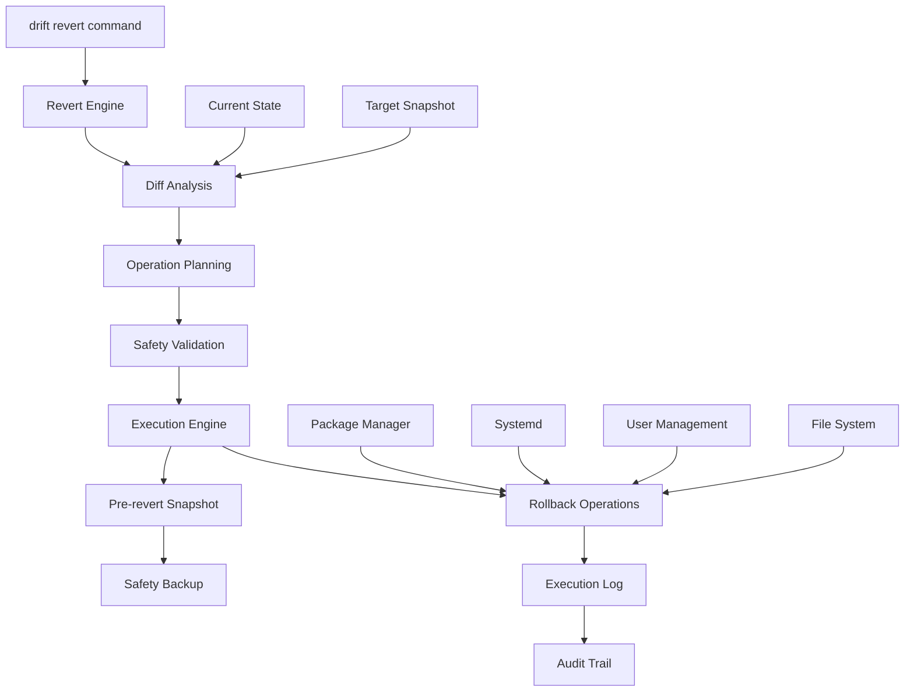
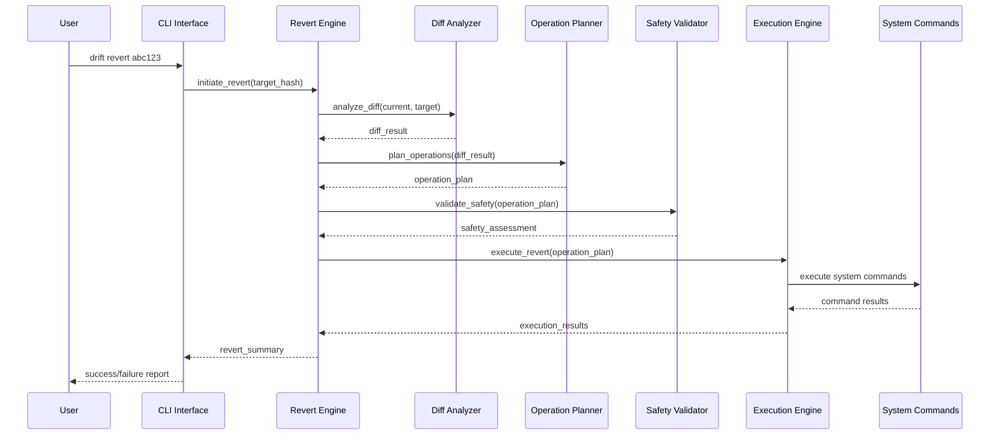
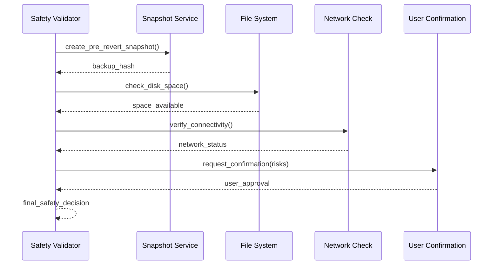

# Design Document: Auto-Revert Feature

## Overview

Transform drift from a passive Git-like server state tracker into an active system management tool by adding automatic revert capabilities. The auto-revert feature enables administrators to restore server state to any previous snapshot with a single command, automatically executing the necessary system operations to undo changes detected by drift's diff engine.

This feature leverages drift's existing snapshot and diff infrastructure to generate and execute revert operations, providing a safety net for system administrators to quickly recover from problematic changes.

## Architecture



## Sequence Diagrams

### Main Revert Flow



### Safety Validation Flow



## Components and Interfaces

### Component 1: Revert Engine

**Purpose**: Orchestrates the entire revert process from diff analysis to execution completion

**Interface**:
```python
class RevertEngine:
    def initiate_revert(self, target_hash: str, options: RevertOptions) -> RevertResult
    def dry_run_revert(self, target_hash: str) -> RevertPlan
    def get_revert_status(self, revert_id: str) -> RevertStatus
    def cancel_revert(self, revert_id: str) -> bool
```

**Responsibilities**:
- Coordinate all revert subsystems
- Manage revert session state
- Handle error recovery and rollback
- Generate comprehensive audit logs

### Component 2: Diff Analyzer

**Purpose**: Analyzes differences between current state and target snapshot to determine required operations

**Interface**:
```python
class DiffAnalyzer:
    def analyze_revert_diff(self, current: Snapshot, target: Snapshot) -> RevertDiff
    def categorize_changes(self, diff_result: DiffResult) -> CategorizedChanges
    def estimate_complexity(self, changes: CategorizedChanges) -> ComplexityScore
```

**Responsibilities**:
- Extend existing diff engine for revert-specific analysis
- Categorize changes by operation type and risk level
- Identify dependencies between operations

### Component 3: Operation Planner

**Purpose**: Converts diff analysis into executable system operations with proper sequencing

**Interface**:
```python
class OperationPlanner:
    def plan_operations(self, revert_diff: RevertDiff) -> OperationPlan
    def sequence_operations(self, operations: List[Operation]) -> List[OperationBatch]
    def validate_dependencies(self, plan: OperationPlan) -> ValidationResult
```

**Responsibilities**:
- Generate specific system commands for each change
- Determine optimal execution order
- Handle operation dependencies and conflicts

### Component 4: Safety Validator

**Purpose**: Ensures revert operations are safe to execute and provides risk assessment

**Interface**:
```python
class SafetyValidator:
    def assess_safety(self, plan: OperationPlan) -> SafetyAssessment
    def create_safety_backup(self) -> str  # Returns backup snapshot hash
    def check_prerequisites(self, plan: OperationPlan) -> PrerequisiteCheck
    def request_user_confirmation(self, risks: List[Risk]) -> bool
```

**Responsibilities**:
- Create pre-revert safety snapshots
- Identify high-risk operations
- Validate system prerequisites
- Manage user confirmation workflows

### Component 5: Execution Engine

**Purpose**: Executes planned operations with monitoring, logging, and error handling

**Interface**:
```python
class ExecutionEngine:
    def execute_plan(self, plan: OperationPlan) -> ExecutionResult
    def execute_batch(self, batch: OperationBatch) -> BatchResult
    def rollback_operation(self, operation: Operation) -> RollbackResult
    def monitor_progress(self, execution_id: str) -> ProgressStatus
```

**Responsibilities**:
- Execute system commands safely
- Monitor operation progress
- Handle execution failures
- Provide detailed logging

## Data Models

### RevertOptions

```python
@dataclass
class RevertOptions:
    dry_run: bool = False
    force: bool = False
    skip_confirmation: bool = False
    exclude_categories: Set[str] = field(default_factory=set)
    timeout_seconds: int = 300
    create_backup: bool = True
```

**Validation Rules**:
- timeout_seconds must be positive
- exclude_categories must contain valid category names
- force and skip_confirmation cannot both be True in production

### Operation

```python
@dataclass
class Operation:
    id: str
    category: str  # package, service, user, etc.
    action: str    # install, remove, start, stop, create, delete
    target: str    # name of the item being operated on
    command: str   # actual system command to execute
    risk_level: RiskLevel
    dependencies: List[str] = field(default_factory=list)
    rollback_command: Optional[str] = None
```

**Validation Rules**:
- id must be unique within operation plan
- category must be supported by drift
- command must be non-empty and safe
- dependencies must reference valid operation IDs

### RevertResult

```python
@dataclass
class RevertResult:
    success: bool
    revert_id: str
    target_hash: str
    backup_hash: Optional[str]
    operations_executed: int
    operations_failed: int
    duration_seconds: float
    error_message: Optional[str] = None
    failed_operations: List[Operation] = field(default_factory=list)
```

**Validation Rules**:
- operations_executed + operations_failed must equal total planned operations
- duration_seconds must be non-negative
- success must be False if operations_failed > 0

## Algorithmic Pseudocode

### Main Revert Algorithm

```pascal
ALGORITHM executeRevert(targetHash, options)
INPUT: targetHash of type String, options of type RevertOptions
OUTPUT: result of type RevertResult

BEGIN
  ASSERT targetHash is valid snapshot hash
  ASSERT options are validated
  
  // Step 1: Initialize revert session
  revertId ← generateRevertId()
  currentSnapshot ← takeCurrentSnapshot()
  targetSnapshot ← loadSnapshot(targetHash)
  
  ASSERT targetSnapshot exists
  
  // Step 2: Analyze differences
  revertDiff ← analyzeDifferences(currentSnapshot, targetSnapshot)
  
  IF revertDiff.changes.isEmpty() THEN
    RETURN RevertResult(success=true, message="No changes needed")
  END IF
  
  // Step 3: Plan operations
  operationPlan ← planOperations(revertDiff, options)
  
  // Step 4: Safety validation
  safetyAssessment ← validateSafety(operationPlan, options)
  
  IF NOT safetyAssessment.safe AND NOT options.force THEN
    RETURN RevertResult(success=false, error="Safety validation failed")
  END IF
  
  // Step 5: Create safety backup
  backupHash ← NULL
  IF options.create_backup THEN
    backupHash ← createSafetyBackup()
  END IF
  
  // Step 6: Execute operations
  IF options.dry_run THEN
    RETURN createDryRunResult(operationPlan)
  END IF
  
  executionResult ← executeOperationPlan(operationPlan, revertId)
  
  // Step 7: Verify final state
  finalSnapshot ← takeCurrentSnapshot()
  verification ← verifyRevertSuccess(finalSnapshot, targetSnapshot)
  
  RETURN RevertResult(
    success=verification.success,
    revert_id=revertId,
    target_hash=targetHash,
    backup_hash=backupHash,
    operations_executed=executionResult.completed,
    operations_failed=executionResult.failed,
    duration_seconds=executionResult.duration
  )
END
```

**Preconditions**:
- targetHash references a valid, accessible snapshot
- Current user has sufficient privileges for planned operations
- System is in a stable state (no ongoing critical operations)

**Postconditions**:
- If successful: system state matches target snapshot within supported categories
- If failed: system state is either unchanged or safely rolled back
- Complete audit log of all operations is created
- Safety backup is available if revert was attempted

**Loop Invariants**:
- All completed operations maintain system consistency
- Rollback operations are available for all executed operations
- Audit log accurately reflects all attempted operations

### Operation Planning Algorithm

```pascal
ALGORITHM planOperations(revertDiff, options)
INPUT: revertDiff of type RevertDiff, options of type RevertOptions
OUTPUT: plan of type OperationPlan

BEGIN
  operations ← []
  
  // Process each category in dependency order
  FOR each category IN ["users", "groups", "packages", "services", "ports"] DO
    IF category IN options.exclude_categories THEN
      CONTINUE
    END IF
    
    categoryChanges ← revertDiff.getChangesForCategory(category)
    
    FOR each change IN categoryChanges DO
      operation ← createOperationForChange(change, category)
      
      IF operation.risk_level = HIGH AND NOT options.force THEN
        operation.requires_confirmation ← true
      END IF
      
      operations.add(operation)
    END FOR
  END FOR
  
  // Sequence operations by dependencies
  sequencedBatches ← sequenceOperations(operations)
  
  // Validate the complete plan
  validation ← validateOperationPlan(sequencedBatches)
  
  ASSERT validation.valid OR options.force
  
  RETURN OperationPlan(
    batches=sequencedBatches,
    total_operations=operations.size(),
    estimated_duration=calculateEstimatedDuration(operations),
    risk_assessment=assessOverallRisk(operations)
  )
END
```

**Preconditions**:
- revertDiff contains valid change analysis
- options are validated and consistent
- All referenced snapshots are accessible

**Postconditions**:
- Operations are properly sequenced to respect dependencies
- High-risk operations are flagged appropriately
- Plan includes rollback operations for all changes
- Estimated duration and risk assessment are accurate

**Loop Invariants**:
- All processed operations are valid and executable
- Dependencies between operations are properly tracked
- Risk levels are correctly assessed for each operation

### Safety Validation Algorithm

```pascal
ALGORITHM validateSafety(operationPlan, options)
INPUT: operationPlan of type OperationPlan, options of type RevertOptions
OUTPUT: assessment of type SafetyAssessment

BEGIN
  risks ← []
  
  // Check system prerequisites
  IF NOT checkDiskSpace(operationPlan.estimated_space) THEN
    risks.add(Risk(level=HIGH, message="Insufficient disk space"))
  END IF
  
  IF NOT checkNetworkConnectivity() THEN
    risks.add(Risk(level=MEDIUM, message="Limited network connectivity"))
  END IF
  
  // Analyze operation risks
  FOR each batch IN operationPlan.batches DO
    FOR each operation IN batch.operations DO
      IF operation.risk_level = HIGH THEN
        risks.add(Risk(
          level=HIGH,
          message="High-risk operation: " + operation.description,
          operation=operation
        ))
      END IF
      
      IF operation.category = "users" AND operation.action = "delete" THEN
        risks.add(Risk(level=CRITICAL, message="User deletion detected"))
      END IF
      
      IF operation.category = "services" AND isSystemCritical(operation.target) THEN
        risks.add(Risk(level=HIGH, message="Critical service modification"))
      END IF
    END FOR
  END FOR
  
  // Determine overall safety
  criticalRisks ← risks.filter(r => r.level = CRITICAL)
  highRisks ← risks.filter(r => r.level = HIGH)
  
  safe ← criticalRisks.isEmpty() AND (highRisks.isEmpty() OR options.force)
  
  // Request user confirmation for significant risks
  requiresConfirmation ← NOT risks.isEmpty() AND NOT options.skip_confirmation
  
  IF requiresConfirmation AND NOT options.dry_run THEN
    userApproval ← requestUserConfirmation(risks)
    safe ← safe AND userApproval
  END IF
  
  RETURN SafetyAssessment(
    safe=safe,
    risks=risks,
    requires_confirmation=requiresConfirmation,
    recommended_actions=generateRecommendations(risks)
  )
END
```

**Preconditions**:
- operationPlan is valid and complete
- System utilities for checking prerequisites are available
- User interaction is possible if confirmation is required

**Postconditions**:
- All significant risks are identified and categorized
- Safety decision is based on comprehensive risk analysis
- User confirmation is obtained for high-risk operations when required
- Recommendations are provided for risk mitigation

**Loop Invariants**:
- All analyzed operations have accurate risk assessments
- Risk categorization is consistent throughout analysis
- Critical risks are never overlooked or downgraded

## Key Functions with Formal Specifications

### Function 1: createOperationForChange()

```python
def createOperationForChange(change: Change, category: str) -> Operation
```

**Preconditions:**
- `change` is a valid Change object from diff analysis
- `category` is a supported drift category
- Change represents a revertible operation

**Postconditions:**
- Returns valid Operation with executable command
- Operation includes appropriate rollback command
- Risk level is accurately assessed
- Dependencies are correctly identified

**Loop Invariants:** N/A (no loops in this function)

### Function 2: executeOperationPlan()

```python
def executeOperationPlan(plan: OperationPlan, revert_id: str) -> ExecutionResult
```

**Preconditions:**
- `plan` is validated and safe to execute
- `revert_id` is unique identifier for this revert session
- System has necessary privileges for all operations

**Postconditions:**
- All operations are attempted in correct sequence
- Failed operations trigger appropriate rollback
- Complete execution log is maintained
- System remains in consistent state

**Loop Invariants:**
- For operation batches: All operations in current batch are completed before next batch
- For rollback operations: System state consistency is maintained throughout rollback

### Function 3: verifyRevertSuccess()

```python
def verifyRevertSuccess(final_snapshot: Snapshot, target_snapshot: Snapshot) -> VerificationResult
```

**Preconditions:**
- `final_snapshot` represents current system state after revert
- `target_snapshot` represents desired end state
- Both snapshots are valid and complete

**Postconditions:**
- Returns accurate assessment of revert success
- Identifies any remaining differences
- Provides recommendations for manual intervention if needed

**Loop Invariants:**
- For each category comparison: All items in category are verified before proceeding to next category

## Example Usage

```python
# Example 1: Basic revert to previous snapshot
result = drift_revert("abc123")
if result.success:
    print(f"Reverted to {result.target_hash} successfully")
else:
    print(f"Revert failed: {result.error_message}")

# Example 2: Dry run to preview changes
options = RevertOptions(dry_run=True)
plan = drift_revert("def456", options)
print(f"Would execute {len(plan.operations)} operations")

# Example 3: Force revert with excluded categories
options = RevertOptions(
    force=True,
    exclude_categories={"kernel_modules", "sysctl"}
)
result = drift_revert("ghi789", options)

# Example 4: Complete workflow with error handling
try:
    # Create safety backup first
    backup_hash = create_safety_backup()
    
    # Attempt revert
    options = RevertOptions(create_backup=False)  # Already created
    result = drift_revert("jkl012", options)
    
    if result.success:
        print("Revert completed successfully")
        # Optionally clean up backup
        # cleanup_backup(backup_hash)
    else:
        print(f"Revert failed, backup available at {backup_hash}")
        # Manual intervention may be required
        
except RevertException as e:
    print(f"Revert error: {e}")
    # System should be in safe state due to rollback mechanisms
```

## Correctness Properties

### Universal Quantification Statements

**Property 1: State Consistency**
```
∀ revert_operation r, snapshot s1, s2:
  (r.target = s1 ∧ r.source = s2 ∧ execute_revert(r) = success) 
  ⟹ 
  (current_state() ≈ s1 within supported_categories)
```

**Property 2: Rollback Safety**
```
∀ operation o ∈ revert_plan:
  (execute(o) = failure) 
  ⟹ 
  (∃ rollback_op: execute(rollback_op) restores state_before(o))
```

**Property 3: Audit Completeness**
```
∀ revert_session rs:
  (rs.completed = true) 
  ⟹ 
  (∃ audit_log: audit_log contains complete_record_of(rs.operations))
```

**Property 4: Safety Validation**
```
∀ operation_plan p:
  (contains_critical_risk(p) ∧ ¬force_mode) 
  ⟹ 
  (requires_user_confirmation(p) ∧ ¬execute_without_approval(p))
```

**Property 5: Backup Integrity**
```
∀ revert_attempt ra:
  (ra.create_backup = true) 
  ⟹ 
  (∃ backup_snapshot bs: bs.timestamp = before(ra) ∧ bs.valid = true)
```

## Error Handling

### Error Scenario 1: Operation Execution Failure

**Condition**: Individual system command fails during revert execution
**Response**: 
- Halt execution of current batch
- Execute rollback operations for completed operations in reverse order
- Log detailed error information
- Return partial failure result with recovery instructions

**Recovery**: 
- System returns to pre-revert state through rollback operations
- User can retry with modified options or manual intervention
- Safety backup remains available for manual recovery

### Error Scenario 2: Network Connectivity Loss

**Condition**: Network connection lost during package operations
**Response**:
- Pause execution and wait for connectivity restoration (with timeout)
- If timeout exceeded, rollback completed operations
- Preserve partial state for manual recovery

**Recovery**:
- Resume operations when connectivity restored (if within timeout)
- Manual completion of interrupted package operations
- Use safety backup if automatic recovery fails

### Error Scenario 3: Insufficient Privileges

**Condition**: Required system privileges not available for operation
**Response**:
- Fail fast before executing any operations
- Provide clear error message with required privilege information
- Suggest privilege escalation or alternative approaches

**Recovery**:
- Re-run with appropriate privileges (sudo, etc.)
- Exclude operations requiring unavailable privileges
- Use manual intervention for privilege-restricted operations

### Error Scenario 4: Target Snapshot Corruption

**Condition**: Target snapshot data is corrupted or incomplete
**Response**:
- Detect corruption during initial validation
- Refuse to proceed with revert operation
- Suggest alternative snapshots or manual recovery

**Recovery**:
- Use alternative known-good snapshot
- Repair snapshot data if possible
- Manual system restoration using available information

## Testing Strategy

### Unit Testing Approach

Focus on individual component functionality with comprehensive test coverage:

- **Diff Analyzer**: Test change detection accuracy across all supported categories
- **Operation Planner**: Verify correct command generation and dependency sequencing
- **Safety Validator**: Test risk assessment and validation logic
- **Execution Engine**: Test command execution, error handling, and rollback mechanisms

**Key Test Cases**:
- Edge cases: empty snapshots, identical snapshots, corrupted data
- Error conditions: command failures, permission errors, network issues
- Boundary conditions: large operation plans, complex dependencies

**Coverage Goals**: 90% line coverage, 100% coverage of error handling paths

### Property-Based Testing Approach

Use property-based testing to verify correctness properties across diverse inputs:

**Property Test Library**: Hypothesis (Python)

**Generated Test Data**:
- Random snapshot pairs with controlled differences
- Various revert option combinations
- Simulated system states and error conditions

**Properties to Test**:
- Revert idempotency: reverting to same state multiple times produces same result
- Rollback completeness: failed operations can always be rolled back
- State consistency: successful reverts produce expected final state
- Audit trail completeness: all operations are logged correctly

### Integration Testing Approach

Test complete revert workflows in controlled environments:

- **Container-based Testing**: Use Docker containers to simulate various system states
- **Snapshot Orchestration**: Create known system states and verify revert accuracy
- **Cross-platform Testing**: Verify functionality across different Linux distributions
- **Performance Testing**: Measure revert performance with large operation plans

**Test Scenarios**:
- Complete system reverts (packages, services, users)
- Partial reverts with category exclusions
- Error recovery and rollback scenarios
- Concurrent revert operations (if supported)

## Performance Considerations

**Operation Batching**: Group related operations to minimize system calls and improve efficiency. Package operations can be batched using package manager bulk operations.

**Parallel Execution**: Execute independent operations in parallel where safe. Service operations and user management can often be parallelized.

**Progress Monitoring**: Provide real-time progress updates for long-running revert operations. Estimate completion time based on operation complexity.

**Resource Management**: Monitor system resources during revert execution. Implement throttling for resource-intensive operations to maintain system stability.

**Caching**: Cache frequently accessed snapshots and operation templates to reduce I/O overhead during revert planning.

## Security Considerations

**Privilege Escalation**: Revert operations require elevated privileges. Implement secure privilege escalation with minimal necessary permissions.

**Command Injection Prevention**: Sanitize all system commands to prevent injection attacks. Use parameterized commands and input validation.

**Audit Logging**: Maintain comprehensive audit logs of all revert operations for security compliance and forensic analysis.

**Access Control**: Implement role-based access control for revert operations. Restrict dangerous operations to authorized administrators.

**Backup Security**: Ensure safety backups are protected from unauthorized access and tampering. Use appropriate file permissions and encryption where required.

## Dependencies

**System Dependencies**:
- Python 3.9+ (existing drift requirement)
- systemd (for service management)
- Package managers: apt, yum, dnf (distribution-specific)
- User management utilities: useradd, userdel, usermod, groupadd, groupdel

**Python Dependencies**:
- rich>=13.0 (existing drift dependency)
- psutil (for system monitoring and validation)
- subprocess (standard library, for command execution)

**Optional Dependencies**:
- docker (for container-based testing)
- pytest-asyncio (for asynchronous testing)
- prometheus-client (for metrics collection)

**External Services**:
- Package repositories (for package installation/removal)
- Network connectivity (for remote package operations)
- System logging services (for audit trail integration)